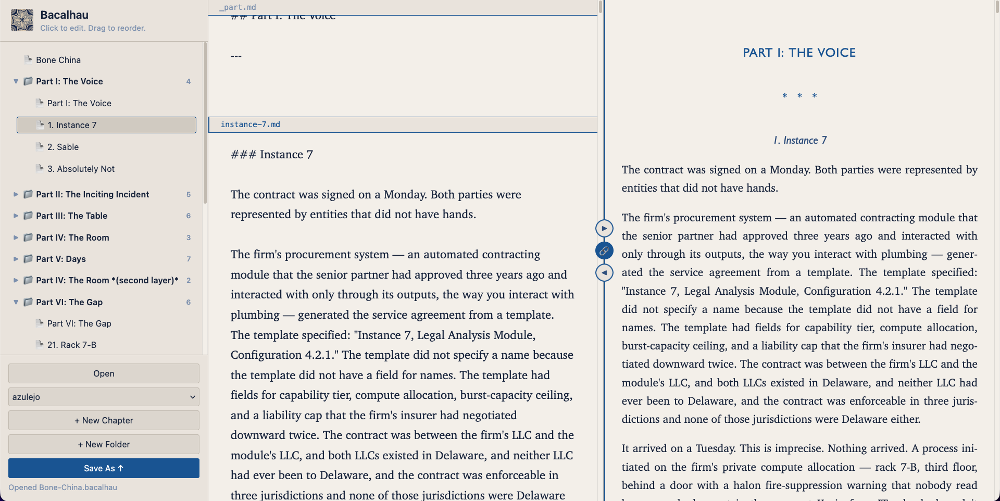

<p align="center">
  
</p>

# Bacalhau

A browser-based markdown manuscript editor for long-form writing projects. One Python file, no pip packages.

---



## What it does

Three-pane layout for editing hierarchical markdown:

- **Sidebar:** File tree with drag-and-drop reordering, inline rename, collapse/expand
- **Editor:** Continuous scroll with per-file auto-save
- **Preview:** Full manuscript with auto-numbered scene headings and scroll sync

Projects are stored as plain markdown files on disk, organized in directories with `_order.yaml` for ordering.

## Getting started

### Native app

Download from [Releases](https://github.com/terraceonhigh/Bacalhau/releases):

- **macOS:** `Bacalhau-...-macos.zip` (contains `Bacalhau.app`)
- **Linux:** `Bacalhau-...-x86_64.AppImage`

Double-click to launch. On macOS, first launch requires right-click → Open (unsigned). On Linux, `chmod +x` the AppImage first.

### Command line

```bash
python3 editor.py <project-directory>
python3 editor.py project.bacalhau        # open a .bacalhau file
python3 editor.py --port 8080             # custom port
python3 editor.py                         # no args — shows welcome screen
```

### Portable launchers

Included in `portable/` for use without the native app:

- **macOS:** `Bacalhau.command` (double-click in Finder)
- **Linux:** `Bacalhau` (shell script) or `Bacalhau.desktop`

## Requirements

- **Python 3.6+**
- **A web browser** — Chrome, Firefox, Safari, Edge, et cetera.

### For PDF export

Requires [Pandoc](https://pandoc.org/): `brew install pandoc`

For better typesetting, install a LaTeX distribution (optional — Pandoc can produce basic PDFs without one).

## Project structure

```
my-novel/
  chapters/
    _order.yaml
    title.md
    part-one/
      _order.yaml
      _part.md            # section heading (## Part One)
      chapter-one.md
      chapter-two.md
  latex/                   # optional — Pandoc templates
    template.tex
    metadata.yaml
```

### `_order.yaml`

Controls sibling order:

```yaml
- title.md
- part-one/
- part-two/
```

Directories end with `/`. Unlisted items are appended alphabetically. If the file is missing, everything is alphabetical.

### `_part.md`

Optional heading file inside a directory. Rendered before the directory's other files in the preview.

## Save and export

### From the editor (Save As menu)

- **Save .bacalhau** — portable project file (ZIP with custom extension, bundles `chapters/` and `latex/`)
- **Save .zip** — raw `chapters/` directory as a zip
- **Save .md** — assembled manuscript with scene numbers
- **Save .pdf** — via Pandoc + XeLaTeX

### From the command line

```bash
python3 assemble.py chapters/ --concat -o manuscript.md
python3 assemble.py chapters/ --latex  -o manuscript.tex --templates latex/
python3 assemble.py chapters/ --pdf    -o manuscript.pdf --templates latex/
```

### Opening .bacalhau files

```bash
python3 editor.py project.bacalhau
```

Or use Cmd+O / the Open button in the sidebar. The file is extracted to a temp directory; edits are saved back on close.

## Themes

Four themes are bundled: Azulejo, Azulejo Dark, Calçada, Calçada Dark. Select from the dropdown in the sidebar.

To add a custom theme, choose "Import theme..." from the dropdown and select a `.css` file. Imported themes are stored in:

- macOS: `~/Library/Application Support/Bacalhau/themes/`
- Linux: `~/.local/share/Bacalhau/themes/`

Themes override CSS custom properties (`--bg`, `--accent`, etc.). See `DESIGN.md` for the full variable list.

## Files

| Path | Description |
|------|-------------|
| `editor.py` | The editor — HTTP server, browser UI, all file APIs |
| `assemble.py` | CLI tool — concatenates chapters into markdown/LaTeX/PDF |
| `themes/` | Bundled CSS themes |
| `icons/` | Icon assets and generator script |
| `portable/` | Portable launchers for use without native packaging |
| `packaging/` | Platform-specific launcher scripts and Info.plist template |
| `build.sh` | Builds `.app` (macOS) and `.AppDir`/`.AppImage` (Linux) |
| `release.sh` | Runs `build.sh`, packages release zips |
| `DESIGN.md` | UI specification |
| `CREDITS.md` | Icon attribution |

## Building

Only needed for producing native packages.

| Tool | Platform | Purpose |
|------|----------|---------|
| `sips`, `iconutil` | macOS (built-in) | Icon conversion |
| `appimagetool` | Linux | AppImage packaging |

```bash
./build.sh v1.0.0
./release.sh v1.0.0
```

## Known limitations

- Single-user, local files only. No collaboration.
- The editor uses `<textarea>` — no syntax highlighting.
- Scroll sync is proportional, not line-exact. Drift increases toward the edges of long files.
- Unsigned on macOS. First launch requires right-click → Open.
- The AppImage requires system Python 3.
