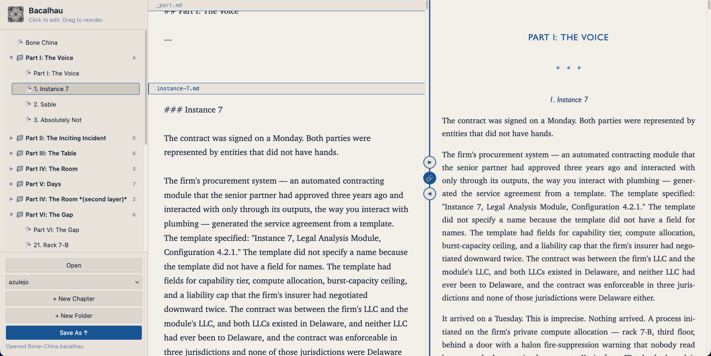

<p align="center">
  
</p>

# Bacalhau

A native desktop manuscript editor for long-form writing projects. Single Go binary, no runtime dependencies.

---



## What it does

Three-pane layout for editing hierarchical markdown:

- **Sidebar:** File tree with drag-and-drop reordering, inline rename, collapse/expand
- **Editor:** Continuous scroll across files with per-file auto-save and seamless arrow-key navigation
- **Preview:** Full manuscript with auto-numbered scene headings and scroll sync
- **Git panel:** Stage, unstage, commit, and restore from history — no terminal required
- **Folder browser:** Open any directory under your home from the UI without touching a terminal

Projects are stored as plain markdown files on disk, organised in directories with `_order.yaml` for ordering.

## Getting started

Download from [Releases](https://github.com/terraceonhigh/Bacalhau/releases):

- **macOS** (10.13+): `Bacalhau-vX.Y.Z-macos.dmg` — Developer ID signed and Apple-notarized; double-click to mount, drag `Bacalhau.app` into Applications
- **Linux** (x86_64): `Bacalhau-vX.Y.Z-linux-amd64.tar.gz` — extract and run the binary (requires `libwebkit2gtk-4.1` and `libgtk-3` from your distro; Ubuntu 24.04+ ships these)
- **Windows** (10+, x86_64): `Bacalhau-vX.Y.Z-windows-amd64.zip` — extract and run `Bacalhau.exe` (uses the system WebView2 runtime, pre-installed on Windows 11; Windows 10 may need the Evergreen WebView2 redistributable)

### Command line

The macOS `.app` and the bare Linux/Windows binaries all accept the same arguments:

```bash
# macOS (installed .app)
open -a Bacalhau --args <project-directory>
open -a Bacalhau --args project.bacalhau

# Linux / Windows (or macOS, running the binary directly)
./Bacalhau <project-directory>     # open a folder of markdown files
./Bacalhau project.bacalhau         # open a .bacalhau file
./Bacalhau                          # no args — opens an empty welcome screen
```

## Project structure

```
my-novel/
  chapters/
    _order.yaml
    title.md
    part-one/
      _order.yaml
      _part.md            # section heading (## Part One)
      chapter-one.md
      chapter-two.md
```

### `_order.yaml`

Controls sibling order. Directories end with `/`:

```yaml
- title.md
- part-one/
- part-two/
```

Unlisted items are appended alphabetically. If the file is missing, everything is alphabetical.

### `_part.md`

Optional heading file inside a directory. Rendered before the directory's other files in the preview.

## Save and export

The **Save As…** dropdown in the sidebar footer offers:

- **.bacalhau** — portable project file (ZIP with custom extension, bundles `chapters/` and `.git/`)
- **.zip** — raw `chapters/` directory as a zip
- **.md** — assembled manuscript with auto-numbered scenes

All save operations use native file dialogs (Wails bindings to the OS).

> The Save As menu also shows `.pdf`, but the backend route it calls isn't wired up in the current build — see [AGENTS.md](AGENTS.md). For now, export `.md` and convert with `pandoc`.

### Opening .bacalhau files

```bash
Bacalhau project.bacalhau
```

Or use the **Open…** dropdown in the sidebar. The file is extracted to a temp directory; edits are repacked back to the original `.bacalhau` on close.

### Browsing folders

Choose **Folder** from the **Open…** dropdown to open a visual directory navigator. Browse your home directory, click into folders, and select one to open. Directories containing markdown files are highlighted with a count badge.

## Themes

Four themes are bundled: Azulejo, Azulejo Dark, Calçada, Calçada Dark. Pick one from the dropdown in the sidebar footer.

To add a custom theme, choose **Import theme…** from the dropdown and select a `.css` file. Imported themes are stored in:

- macOS: `~/Library/Application Support/Bacalhau/themes/`
- Linux: `~/.local/share/Bacalhau/themes/`
- Windows: `%APPDATA%\Bacalhau\themes\`

Themes override CSS custom properties (`--bg`, `--accent`, etc.). See [DESIGN.md](DESIGN.md) for the full variable list.

## Version control

The **Git** tab in the sidebar gives you:

- **Status:** files changed (M/A/D/? badges)
- **Stage/Unstage:** per-file or all-at-once, with `+` and `−` buttons
- **Commit:** enter a message and checkpoint your work — all changes are staged automatically
- **History:** the last 20 commits touching the project, with one-click **Restore** to any version

Restore is non-destructive: Bacalhau auto-saves your current state to a new commit before reverting, so every version remains recoverable. No git knowledge required.

If no repository exists, the panel offers an **Initialize Repository** button. Projects opened from `.bacalhau` files (temporary extraction) hide the git controls.

Requires the `git` binary on PATH. The panel degrades gracefully if it's not available.

## Demo project

A sample novella, *The Salted Page*, lives in `demo/chapters/` with two parts (Past and Present) to demonstrate hierarchical structure:

```bash
Bacalhau demo/chapters
```

## Building from source

Requires Go 1.22+ (the compiled binary itself has no runtime Go dependency). The release pipeline uses Go 1.22; `go.mod` may declare a higher toolchain version but the code is 1.22-compatible.

```bash
# macOS / Linux dev binary
CGO_LDFLAGS="-framework UniformTypeIdentifiers" \
  go build -tags "desktop,production" -ldflags "-X main.version=dev" -o Bacalhau .

# macOS .app bundle (ad-hoc signed, for testing the bundle layout)
./build-app.sh dev

# Linux: also needs libgtk-3-dev libwebkit2gtk-4.1-dev libsoup-3.0-dev
go build -tags "desktop,production,webkit2_41" -o Bacalhau .

# Windows
go build -tags "desktop,production" -ldflags "-H windowsgui" -o Bacalhau.exe .
```

### Releases

Tag-triggered: pushing `vX.Y.Z` runs [`.github/workflows/release.yml`](.github/workflows/release.yml), which builds all three platforms, signs and notarizes the macOS `.dmg` with Apple, and publishes a GitHub Release with all artifacts attached.

```bash
git tag -a vX.Y.Z -m "release notes"
git push origin vX.Y.Z
```

## Files

| Path | Description |
|------|-------------|
| `main.go` | Entry point — Wails lifecycle, native file dialogs (`OpenFile`, `SaveToFile`) |
| `internal/server/` | HTTP handler — all API routes (served in-process via Wails AssetServer) |
| `internal/fs/` | Filesystem ops — `.bacalhau` ZIP packing, `_order.yaml`, tree walking |
| `internal/git/` | Git operations — shells out to system `git` |
| `internal/state/` | Mutex-protected shared state |
| `internal/themes/` | Theme CSS discovery and import |
| `static/` | Frontend SPA — HTML, CSS, JavaScript (embedded into the binary) |
| `vendor_js/` | Vendored JS (`markdown-it.min.js`, embedded) |
| `themes/` | Bundled CSS themes (embedded) |
| `demo/` | Sample project — *The Salted Page* |
| `icons/` | Icon assets and generator script |
| `packaging/macos/` | `Info.plist.template`, entitlements, launcher |
| `packaging/linux/` | `AppRun`, `.desktop`, MIME XML |
| `build-app.sh` | Builds `Bacalhau.app` locally for macOS |
| [DESIGN.md](DESIGN.md) | UI specification |
| [ARCHITECTURE.md](ARCHITECTURE.md) | API and module contracts |
| [CREDITS.md](CREDITS.md) | Icon attribution |

## Known limitations

- Single-user, local files only. No collaboration.
- The editor uses `<textarea>` — no syntax highlighting.
- Scroll sync is proportional, not line-exact. Drift increases toward the edges of long files.
- The folder browser is restricted to your home directory for security.
- Linux requires `libwebkit2gtk-4.1` (Ubuntu 24.04+ ships it; older distros may need backports).
